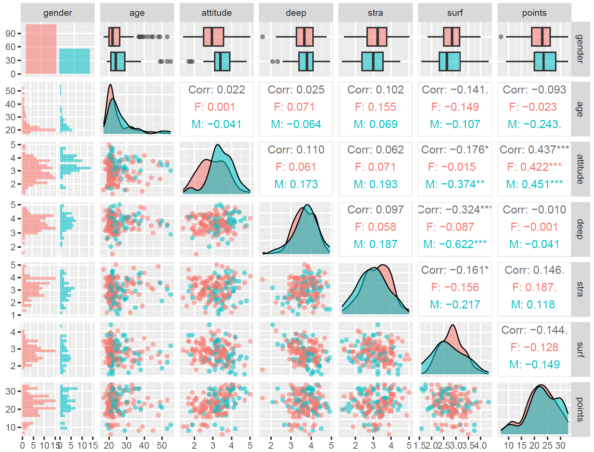
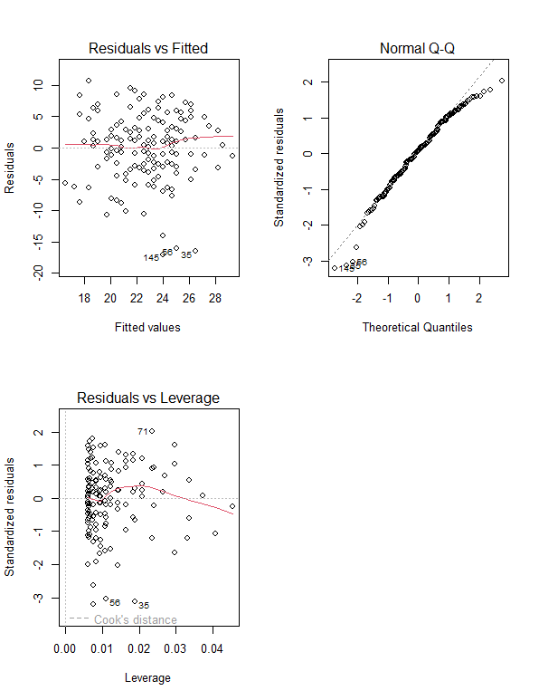
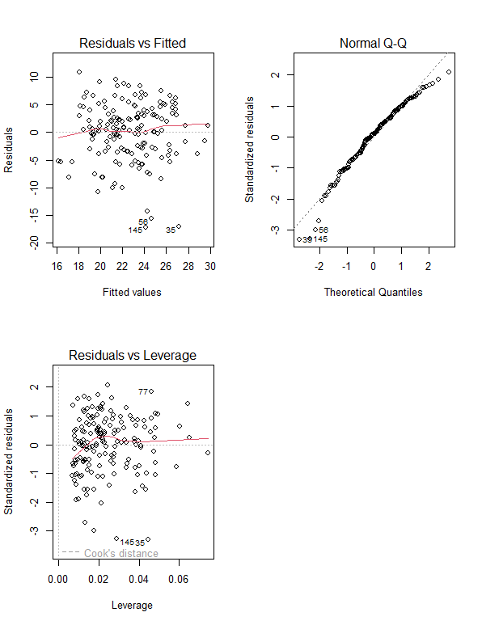

# Assignment 2: Analysis

The dataset used in this assignment is from a survey of learning approaches and achievements of students on an introductory statistics course. In this assignment we use a subset of the results including information on gender, age, attitude, total points and approaches (deep, surface and strategic) of 166 students.

## Reading data in and graphical overview of the data

```{r}
# access the GGally and ggplot2 libraries
library(GGally)
library(ggplot2)

#Read the data in:
learning2014 <- read_csv("./data/learning2014.csv")
#Explore dimensions:
dim(learning2014)
#and structure
str(learning2014)

# draw a scatter plot matrix of the variables in learning2014.
# [-1] excludes the first column (gender)
pairs(learning2014[-1])

# create a more advanced plot matrix with ggpairs()
p <- ggpairs(learning2014, mapping = aes(col = gender, alpha = 0.3), lower = list(combo = wrap("facethist", bins = 20)))
# draw the plot
p

```

In the first scatter plot matrix each variable is plotted against each others. The variables are written in a diagonal in the plot. In the plots on the same row with the variable text box the variable is on the y axis of the plot. In the plots in the same column with the variable text box the variable is on the x-axis of the plot.

Based on this scatter plot matrix there are no clearly visible correlations between any of the variables. However, some seem to have some kind of upward or downward trend such as attitude and points as well as deep vs surface strategies.



In the second plot matrix created with ggpairs() the variables are on the top and left side of the plot. The top right side of the matrix shows the correlation between the continuous variables (age, attitude, deep, strategic, surface), the lower left side shows the scatter plots of the continuous variables, the diagonal the density plots of the continuous variables, and the leftmost column shows the histograms and box plots for the combinations between the categorical and the continuous variables.

From the matrix we can see that majority of the interviewees were female and around 20 years old. Age was not significantly correlating with any variable. Attitude had significant positive correlation with points and significant negative correlation with surface approach. Deep approach had significant negative correlation with surface approach. Strategic approach had negative correlation with surface approach. This matrix confirmed the trends that were visible in the previous scatter plot matrix

## Regression model

```{r}
# create a regression model with three explanatory variables
my_model2 <- lm(points ~ attitude + stra + surf, data = learning2014)

# print out a summary of the model
summary(my_model2)

```

```{r}
# create a regression model without the variables that did not have statistically significant relationship with points
my_model3 <- lm(points ~ attitude, data = learning2014)

# print out a summary of the model
summary(my_model3)

```

Based on the results of the t-test used in the linear regression the only significant correlation seems to be a positive correlation between attitude and points (P\<0.001). The t-test compares the means of the two groups and tests whether the differences between them are related. As both the strategic and surface variables had a p-value greater than 0.1 they did not have statistically significant relationship with points variable.

The multiple R-squared for the first regression model with all three explanatory variables is 0.2074. This means that only little of the variability in the points is explained by these explanatory variables. Even though the relationship between attitude and points is significant the R-squared value of the regression model including only them is even smaller at 0.1906 meaning that attitude explains even less of the variability in the points.

## Diagnostic plots

```{r}
# draw diagnostic plots using the plot() function. Choose the plots 1, 2 and 5 for Residuals vs Fitted values, Normal QQ-plot and Residuals vs Leverage
par(mfrow = c(2,2))
plot(my_model2, c(1,2,5))

#same for the model with only attitude as the explanatory variable
par(mfrow = c(2,2))
plot(my_model3, c(1,2,5))

```





It seems that there is no distinctive pattern in the Residuals vs fitted plots in either case meaning that there is no non-linear relationship between the explanatory and target variables.

The normal Q-Q plots show somewhat straight lines following the dotted line with exceptions in the beginning and end. These exceptions may indicate that the data is not following a normal distribution.

In the residuals vs leverage plots there would be dotted lines in the upper and lower right corners showing if some of the observations had high Cook's distance scores meaning they are influential to the regression results and are not following the trend in the rest of the cases. In these plots none of the cases seem to be very influential to the regression results.
