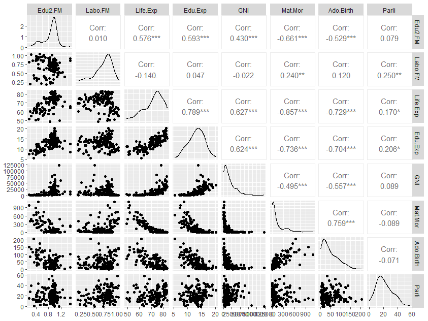
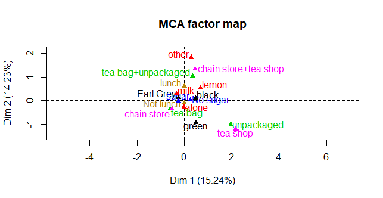
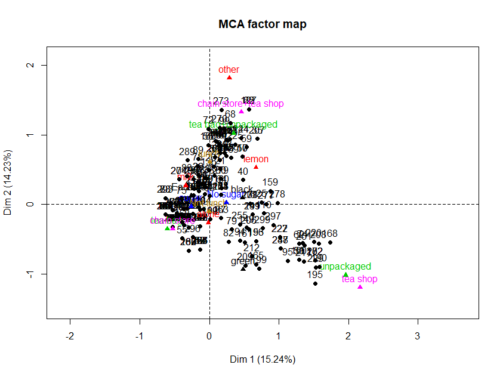

# Assignment 5 analysis 

## 1. Graphical overview and summaries of the data


```{r 1. overview}
# Load libraries:

library(tibble)

# read in data:
human <- read_csv("./data/human.csv")
# country names to rownames

human <- column_to_rownames(human, "country")

#summaries of variables in data
summary(human)

# graphical summary
library("GGally")
p <- ggpairs(human)

# calculate the correlation matrix and round it
cor_matrix <- cor(human) %>% round(digits = 2)

# print the correlation matrix
cor_matrix

# visualize the correlation matrix
corrplot(cor_matrix, method="circle", type = "upper", cl.pos = "b", tl.pos = "d", tl.cex = 0.6)


```



In the plot matrix created with ggpairs() the variables are on the top and left side of the plot. The top right half of the matrix shows the correlation between the variables, the lower left half shows the scatter plots of the continuous variables, the diagonal the density plots of the continuous variables.

From the matrix we can see that many variables correlate statistically significantly with each other. There is both negative and positive correlations. From the distribution plots in the diagonal as well as summaries of the variables we can see that none of the variables are normally distributed.

The correlation plot visualises the correlations between variable better and we can see for example that life expectancy and expected years of schooling is strongly negatively correlated with maternal mortality ratio and adolescent birth rate.

## 2. Principal component analysis (PCA) and a biplot for non-standardised data

```{r 2. PCA}
# perform principal component analysis (with the SVD method)
pca_human <- prcomp(human)

# draw a biplot of the principal component representation and the original variables, with PC1 and PC2
p <- biplot(pca_human, choices = 1:2, cex = c(0.8, 1), col = c("grey40", "deeppink2"))
```


## 3. & 4. PCA and biplot with standardised data

```{r 3. PCA}
# standardise the variables:
human_std <- scale(human)
summary(human_std)
human_std <- as.data.frame(human_std)

# repeat PCA:
# perform principal component analysis (with the SVD method)
pca_human <- prcomp(human_std)

# draw a biplot of the principal component representation and the original variables, with PC1 and PC2
p <- biplot(pca_human, choices = 1:2, cex = c(0.8, 1), col = c("grey40", "deeppink2"))


```


### Interpretations of PCA biplots 

The PCA biplots created with standardised and non-standardised data do differ. This is likely due to that standardization makes the values more comparable and therefore the PCA biplots look different as well.
In the non standardised biplot only the gross national income per capita seems to have influence on the first principal component and no influence on the second principal component. Looks like the other variables have no influence on the principal components. There is no clear separate clusters but two groups could be seen, one forming a vertical group and one forming a diagonal group. 

### Here included interpratations for exercise 4. as well:
In the PCA biplot with standardised data it is visible that more variables have influence on the principal components (PC). Most of the variables seem to influence the first PC, only Percent Representation in Parliament (Parli) and ratio of labor force participation of females and males(Labo.FM) don't seem to influence PC1 much. Parli and Labo.FM seem to influence the second PC. Maternal Mortality Ratio (Mat.Mor) and Adolescent Birth Rate seem to positively correlate as well as Life expectancy at birth (Life.Exp), ratio of female and male populations with secondary education, Gross National Income per capita and Expected years of schooling. Variables in these two groups also negatively correlate with the variables from the other group (eg. Mat.Mor negatively correlates with Life.Exp). Parli and Labo.FM are positively correlated but do not correlate with other variables.

## 5. Multiple correspondence analysis
About the data: "The tea data comes from the FactoMineR package and it is measured with a questionnaire on tea: 300 individuals were asked how they drink tea (18 questions) and what are their product's perception (12 questions). In addition, some personal details were asked (4 questions)."

```{r 5. MCA}
# Load libraries:
library(dplyr)
library(tidyr)
library(ggplot2)
library(FactoMineR)
#library(factoextra)
# Load tea data
tea <- read.csv("https://raw.githubusercontent.com/KimmoVehkalahti/Helsinki-Open-Data-Science/master/datasets/tea.csv", stringsAsFactors = TRUE)

# Look at structure and dimensions of the data
str(tea)
dim(tea) # 300 obs. 36 var.
View(tea)

# From now on I will focus on the "Tea", "How", "how", "sugar", "where" and "lunch" columns:
# column names to keep in the dataset
keep_columns <- c("Tea", "How", "how", "sugar", "where", "lunch")

# select the 'keep_columns' to create a new dataset
tea_time <- select(tea, keep_columns)

# look at the summaries and structure of the data
summary(tea_time)
str(tea_time)

# visualize the dataset

pivot_longer(tea_time, cols = everything()) %>% 
  ggplot(aes(value)) + facet_wrap("name", scales = "free") + geom_bar() + theme(axis.text.x = element_text(angle = 45, hjust = 1, size = 8))

# multiple correspondence analysis
mca <- MCA(tea_time, graph = FALSE)

# summary of the model
summary(mca)

# visualize MCA
p1 <- plot(mca, invisible=c("ind"), graph.type = "classic", habillage = "quali")
p2 <- plot(mca, graph.type = "classic", habillage = "quali")

```


In the MCA plot it is visible that the varibales other, unpackaged and teashop are situated close to each other this means that they are similar to each other in relation to all variables. It could be that people that buy tea from tea shop also by tea unpackaged. These variables are far from the origin and they have effect on on both dimensions. The variables other, chainstore+tea shop, and tea bag+unpackaged are also situated closely to each other meaning they are similar to each other in realtion to other variables and they influence the dimension 2. Green is situated separately from all other variables meaning that it could be somehow different from all other variables and it influences mostly the dimension 1. The map with both variables and individuals shows how the individuals are situated in the space in in relation to each other, the variables, and dimensions.


